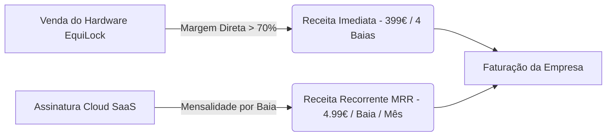

# EquiLock (GallopIT): Plano de Negócios e Estudo de Mercado (Business Plan)
**Versão 1.0 - Estratégia de Comercialização, Benchmarking e Modelo Financeiro**

---

## 1. Resumo Executivo (Executive Summary)

O **EquiLock** é uma solução **IoT (Internet of Things)** e **SaaS (Software as a Service)** concebida para revolucionar a gestão de cavalariças modernas. O sistema combina um módulo eletrónico exterior com trincos/atuadores de 12V em perfis de alumínio e um dashboard web inteligente.

### O Problema
* **Custos Operacionais Elevados:** A libertação matinal, a alimentação agendada e a rotação de cavalos nas baias exigem presença humana diária a horas extremamente madrugadoras (06:00h / 07:00h).
* **Falta de Pontualidade & Stresse Animal:** Atrasos na rotina de alimentação causam ansiedade, stresse e problemas digestivos (ex: cólicas e úlceras gástricas) nos cavalos.
* **Inexistência de Auditoria:** Os donos das cavalariças e proprietários dos cavalos não têm forma de verificar se o animal foi alimentado ou solto no horário correto.

### A Solução EquiLock
Um sistema modular automatizado instalado **no exterior das baias** que gere até 4 portas/trincos por unidade central, com 4 modos de operação (Manual, Sequência com Atraso, Agendamento por Hora/Minuto e Fallback Autónomo Offline). O sistema é acompanhado por uma plataforma cloud de gestão multi-nível (Developer, Admin da Cavalariça e Tratadores).

---

## 2. Análise do Mercado (EquineTech & Smart Stables)

O mercado global de tecnologia equestre (*EquineTech*) tem registado um crescimento vertiginoso (CAGR estimado de 7.8% até 2030), impulsionado pela digitalização de haras, centros de hipismo, picadeiros e pequenas cavalariças privadas na Europa e América do Norte.

### Segmentos de Clientes Target (TAM / SAM / SOM)

```text
[TAM - Total Addressable Market]
+-----------------------------------------------------------------------+
| ~60 Milhões de Cavalos e 1.5 Milhões de Cavalariças em todo o mundo.  |
+-----------------------------------------------------------------------+
                                  |
                                  v
[SAM - Serviceable Addressable Market]
+-----------------------------------------------------------------------+
| ~150.000 Centros Hípicos e Haras Profissionais na Europa & EUA.     |
+-----------------------------------------------------------------------+
                                  |
                                  v
[SOM - Serviceable Obtainable Market (Fase Inicial - 3 Anos)]
+-----------------------------------------------------------------------+
| 500 Cavalariças na Europa do Sul (Portugal, Espanha e França).        |
+-----------------------------------------------------------------------+
```

1. **Centros Hípicos e Escolas de Equitação:** Elevado número de baias (15 a 50+ boxes). Alta necessidade de otimização de custos com tratadores.
2. **Haras e Coudelarias de Criação:** Necessidade de rotinas estritas e auditoria de horários para animais de elevado valor económico.
3. **Proprietários Privados (Cavalariças de Lazer):** Donos de 2 a 5 cavalos em propriedades próprias que procuram autonomia nos fins-de-semana sem dependência constante de terceiros.

---

## 3. Análise da Concorrência & Benchmarking

Atualmente, o mercado dividia-se entre sistemas de alimentação de feno dedicados e soluções artesanais de portões:

| Solução / Concorrente | Tipo de Sistema | Custo por Baia | Vantagens | Desvantagens / Oportunidade para EquiLock |
| :--- | :--- | :--- | :--- | :--- |
| **Haygain StableGrazer** | Comedouro automático de feno dentro da baia | ~1.200€ / baia | Marca consolidada no feno | Extremamente caro; instalado dentro da baia (sujeito a danos); não gere acessos. |
| **iFEED** | Dispensador automático de ração/grãos | ~550€ / baia | Compacto para grãos | Apenas para ração granulada; exige cablagem individual cara por porta. |
| **Feed-X / Timers Mecânicos** | Relógio mecânico para portões de pasto | ~150€ / unidade | Funciona a corda sem bateria | Apenas para exteriores/pastos; sem conectividade, sem logs, sem controlo remoto. |
| **Soluções DIY (Shelly / Maglocks)** | Adaptadores caseiros com relés | ~80€ / baia | Muito barato | Sem certificação, sem gestão de utilizadores (RBAC), sem sequência inteligente, sem abertura de emergência segura. |
| **EquiLock (Nossa Solução)** | **Módulo Inteligente de 4 Trincos Exteriores + SaaS** | **~85€ a 110€ / baia** *(Unidade de 4x = 350€-450€)* | **Instalação exterior segura, 4 modos inteligentes (Sequência/Agenda), Abertura Manual de Emergência, Dashboard Web com logs e RBAC.** | **Nenhuma solução no mercado combina hardware exterior multi-box com SaaS dedicado.** |

---

## 4. Proposta de Valor Única (UVP)

1. **Arquitetura Multi-Box Económica:** 1 único cérebro (ESP32) controla 4 baias simultaneamente, reduzindo o custo por cavalo para menos de 1/4 da concorrência.
2. **Instalação Externa Zero-Risk:** 100% dos componentes eletrónicos e atuadores ficam do lado de fora da box. Impossível para o cavalo morder, pontapear ou danificar os cabos.
3. **Abertura Segura de 4 Segundos & Override Manual:** Pulso elétrico temporizado evita aquecimento e permite a abertura manual instantânea por qualquer humano em caso de emergência.
4. **Resiliência Offline Total (NTP + EEPROM):** Se a rede Wi-Fi da cavalariça cair, a memória interna do equipamento garante a execução continuada dos horários programados.
5. **Ecossistema Software SaaS:** Painel web completo com níveis de acesso (Developer, Client Admin e Tratador) e registo de auditoria em tempo real.

---

## 5. Modelo de Negócio & Monetização

O EquiLock adotará um modelo híbrido **Hardware + SaaS (Software como Serviço)**:



### 1. Venda de Hardware (One-Time)
* **Kit EquiLock Core (4 Baias):** 399.00€ (Preço de Custo BOM V2: ~87€). Margem Bruta: **78%**.
* **Kit Extensão (+ 4 Baias):** 299.00€.

### 2. Subscrição Software SaaS (Receita Recorrente - MRR)
* **Plano Basic (Até 4 Baias):** Gratuito (Controlo manual e local).
* **Plano Pro Stables (Acesso Remoto Cloud, Notificações SMS/Push, Agendamento Ilimitado e Auditoria):** 4.99€ / baia / mês (Ex: Cavalariça com 20 baias = ~99.80€/mês de receita recorrente).
* **Plano Enterprise (Haras / Centros Hípicos 50+ Baias):** Suporte prioritário, integração com software de gestão hípica e multi-proprietários (149.00€/mês).

---

## 6. Estratégia Go-To-Market (GTM)

### Fase 1: Validação & Pilotos LOCAIS (Meses 1 a 6)
* **Parcerias Piloto:** Instalação gratuita do MVP em 3 Centros Hípicos de referência em Portugal (ex: Região de Lisboa/Santarém/Norte) em troca de testemunhos em vídeo e dados operacionais reais.
* **Certificação & Refinamento:** Passar do protótipo de perfil 2020 para o invólucro estanque V2 com certificação CE.

### Fase 2: Lançamento Direto B2B & Feiras Equestres (Meses 6 a 18)
* **Presença em Eventos do Sector:** Feira da Golegã, Feira do Cavalo, Eventos de Saltos de Obstáculos (CSNs/CSIs) e concursos de Ensino/Adestramento.
* **Demonstração Interativa:** Stand com maquete de 4 baias ligadas ao Dashboard Web para testes ao vivo por potenciais compradores.
* **Venda Direta a Donos de Cavalariças:** Abordagem direta a gerentes de centros hípicos destacando a poupança em mão-de-obra.

### Fase 3: Expansão Internacional & Rede de Distribuidores (Meses 18 a 36)
* Parcerias com construtores e fabricantes de estruturas metálicas para baias (ex: Cheval Liberté, Corton, Röwer & Rüb) para oferecer o EquiLock como **opção pré-instalada de fábrica**.

---

## 7. Projeções Financeiras (Horizontes de 3 Anos)

### Premissas do Modelo Financeiro
* **Ano 1:** 50 Unidades Vendidas (200 Baias Automatizadas).
* **Ano 2:** 250 Unidades Vendidas (1.000 Baias).
* **Ano 3:** 800 Unidades Vendidas (3.200 Baias).

| Métrica Financeira | Ano 1 | Ano 2 | Ano 3 |
| :--- | :--- | :--- | :--- |
| **Vendas de Hardware (€)** | 19.950 € | 99.750 € | 319.200 € |
| **Receita Recorrente SaaS (MRR/ARR) (€)** | 4.800 € | 28.800 € | 115.200 € |
| **Receita Total Anual (€)** | **24.750 €** | **128.550 €** | **434.400 €** |
| Custo de Produtos Vendidos (COGS) | 4.350 € | 21.750 € | 69.600 € |
| Margem Bruta (€) | 20.400 € (82%) | 106.800 € (83%) | 364.800 € (84%) |
| Custos Operacionais (R&D, Marketing, AWS) | 12.000 € | 45.000 € | 120.000 € |
| **EBITDA / Lucro Operacional (€)** | **+8.400 €** | **+61.800 €** | **+244.800 €** |

---

## 8. Análise de Risco e Mitigação

1. **Risco de Fuga ou Ferimento Animal (Severidade: Elevada / Probabilidade: Baixa)**
   * *Mitigação:* O equipamento instala-se no exterior da porta; pulso máximo de 4s; abertura prévia com aviso luminoso LED e sinal sonoro opcional para habituar o cavalo antes da abertura.
2. **Falha de Conectividade Wi-Fi no Estábulo (Severidade: Média / Probabilidade: Elevada)**
   * *Mitigação:* Modo autónomo no ESP32 com relógio interno (NTP + RTC software) e EEPROM. O sistema funciona 100% offline se a rede falhar.
3. **Resistência da Concorrência Tradicional (Severidade: Média / Probabilidade: Média)**
   * *Mitigação:* Demonstrar o ROI imediato (a poupança de horas de trabalho do tratador paga o investimento no primeiro ano).

---

## 9. Conclusão & Recomendação Estratégica

**Compensa avançar com o MVP do EquiLock? SIM!**

O projeto posiciona-se num **"oceano azul"** da tecnologia equestre: enquanto os concorrentes vendem comedouros individuais extremamente caros (1.000€+ por cavalo), o EquiLock oferece **automação completa de acessos e rotinas para 4 baias por menos de 400€**, combinando hardware durável no exterior com um modelo SaaS escalável.

O MVP atual em perfis 2020 e ESP32 é a **ferramenta perfeita para validação de conceito, gravação de vídeos de demonstração e captação dos primeiros clientes piloto ou investidores anjo.**
