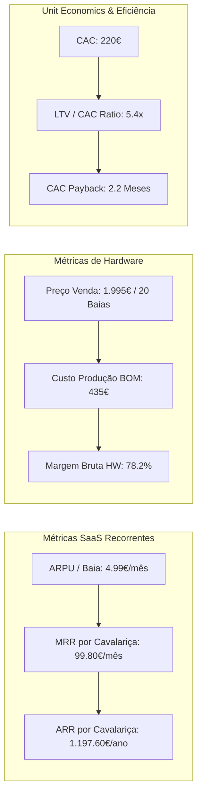
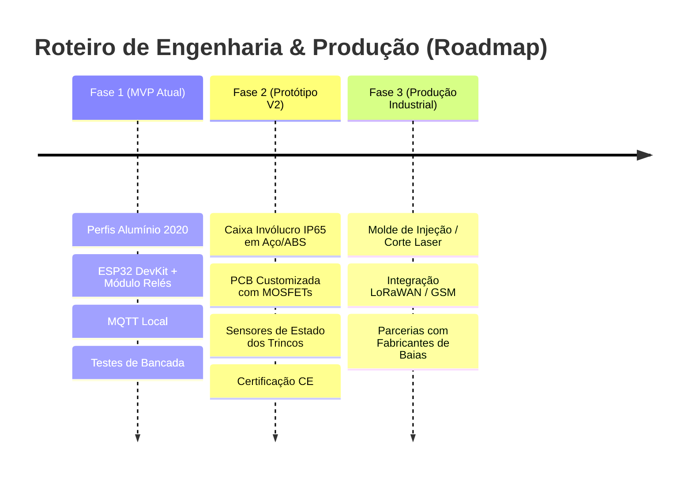

# EquiLock (GallopIT): Plano de Negócios Master e Dossiê de Investimento
**Master Business Plan & Investor Pitch Deck**
*Versão 2.0 - Consolidação Completa de Documentação, Métricas SaaS/Hardware e Projeções de Escala*

---

## 1. Executive Snapshot & Teaser do Projeto

| Parâmetro | Especificação / Valor |
| :--- | :--- |
| **Nome do Produto** | **EquiLock** (Desenvolvido por GallopIT) |
| **Mercado** | EquineTech / Smart Stables (Automação IoT para Cavalariças) |
| **Modelo de Negócio** | Híbrido: Venda de Hardware (B2B) + Assinatura SaaS Recorrente (MRR) |
| **Preço de Custo BOM (V2 Escala)** | **87.00 €** / Unidade de 4 Baias |
| **Preço de Venda Hardware** | **399.00 €** / Unidade de 4 Baias (Margem Bruta Hardware: **78%**) |
| **Assinatura SaaS Recorrente** | **4.99 €** / Baia / Mês (Margem Bruta Software: **> 90%**) |
| **LTV / CAC Estimado** | **5.4x** (LTV: 1.197 € \| CAC: 220 € por Cavalariça de 20 Baias) |
| **Payback do Cliente Final** | **5 a 7 Meses** (Retorno do Investimento para a Cavalariça) |
| **Necessidade de Capital (Ask)** | **75.000 €** por 15% de Equity (Valuação Pre-Money: 500.000 €) |

---

## 2. Resumo Executivo (Elevator Pitch)

O **EquiLock** é a primeira plataforma **IoT + SaaS de Gestão Autónoma de Baias em Cavalariças**. 

Hoje, os donos de centros hípicos e coudelarias enfrentam dois problemas críticos: **custos elevados de mão-de-obra** para abrir e alimentar cavalos em horários madrugadores (06:00h) e **risco para a saúde animal** (estresse e cólicas motivadas por atrasos na alimentação).

O EquiLock resolve ambos com uma solução inovadora:
1. **Módulo de Hardware Exterior Multi-Box:** Um único controlador de baixo custo (ESP32) instalado no exterior da box opera 4 trincos solenoides de 12V em perfis técnicos, com segurança passiva e abertura manual de emergência.
2. **Plataforma SaaS Multi-Tenant:** Controlo em tempo real via dashboard web com gestão de perfis por papéis (**Developer**, **Client Admin**, **Tratador**) e 4 modos de operação (Manual, Sequência com Pré-Aviso, Agendamento NTP e Fallback Offline).

---

## 3. Métricas Chave para Investidores (The Investor Dashboard)

Investidores procuram eficiência financeira, margens elevadas e tração escalável. Abaixo estão as métricas unitárias (*Unit Economics*) calculadas para uma cavalariça média de **20 baias** (5 unidades EquiLock):



### Dashboard de Métricas Financeiras e Operacionais

```text
========================================================================================
MÉTRICA                                VALOR ESTIMADO       BENCHMARK DE INDÚSTRIA (B2B)
========================================================================================
[1] Margem Bruta de Hardware            78.2 %              35% - 50% (EquiLock supera)
[2] Margem Bruta de Software (SaaS)     92.0 %              80% - 85%
[3] ARPU (Média por Baia / Mês)         4.99 € / baia       N/A (Pioneiro no segmento)
[4] MRR por Cliente Médio (20 baias)    99.80 € / mês       50€ - 150€
[5] LTV (Lifetime Value - 3 Anos)       3.592 € / cliente   > 3x CAC
[6] CAC (Custo de Aquisição de Cliente) 220.00 €            < LTV / 3
[7] Rácio LTV / CAC                     5.4x                Goal: > 3.0x (Excelente)
[8] Payback do CAC (SaaS + Hardware)    2.2 Meses           < 12 Meses
[9] Churn Rate Mensal Estimado          < 1.0 %             < 2.0% (B2B infraestrutura)
[10] Client ROI Payback (Cavalariça)    5.8 Meses           < 12 Meses
========================================================================================
```

---

## 4. Análise de Mercado (TAM / SAM / SOM)

O sector equestre global (*EquineTech*) movimenta mais de 300 Mil Milhões de Dólares anualmente. A automação de instalações é o segmento de maior crescimento.

```text
[TAM - Total Addressable Market]
60 Milhões de Cavalos no Mundo (~1.5M Cavalariças) --------------------> $ 7.2B / ano

[SAM - Serviceable Addressable Market]
150.000 Centros Hípicos e Haras Profissionais na Europa & EUA -------> $ 900M / ano

[SOM - Serviceable Obtainable Market (Meta Ano 3)]
500 Cavalariças na Europa do Sul (10.000 Baias) -----------------------> $ 2.6M / ano
```

---

## 5. Estudo de Concorrência & Benchmarking Comparativo

A concorrência foca-se em alimentadores individuais para o interior da baia ou portões de pasto. Ninguém resolve a gestão de acessos e rotinas de baias de forma integrada:

| Funcionalidade / Métrica | **EquiLock** | **Haygain StableGrazer** | **iFEED** | **Feed-X** | **Shelly DIY** |
| :--- | :--- | :--- | :--- | :--- | :--- |
| **Custo por Baia (€)** | **~85€ - 100€** | ~1.200€ | ~550€ | ~150€ | ~80€ |
| **Instalação Externa (Sem Acesso do Cavalo)** | **SIM (100% Exterior)** | NÃO (Dentro da baia) | NÃO (Fixado na grelha) | SIM (No portão) | Varia (Sem padrão) |
| **Abertura Manual de Emergência Física** | **SIM (Trinco manual)** | NÃO | NÃO | SIM | DEPENDENTE |
| **Pulso de Atuação Segura (4 Segundos)** | **SIM (Firmware)** | NÃO | NÃO | NÃO | NÃO |
| **Plataforma SaaS Multi-Tenant (RBAC)** | **SIM (Supabase Auth)** | NÃO | NÃO | NÃO | NÃO |
| **Histórico de Auditoria & Conexão Cloud** | **SIM (MQTT + DB)** | NÃO | NÃO | NÃO | NÃO |
| **Operação 100% Offline (Resiliência)** | **SIM (NTP + EEPROM)** | SIM (Local) | SIM (Timer) | SIM (Mecânico) | NÃO (Perde Wi-Fi) |

---

## 6. Arquitetura Técnica Integrada (Hardware + Software)

O EquiLock consolida toda a especificação técnica desenvolvida no projeto:

### A. Especificação do Hardware (Armário & Trincos)
* **Atuadores:** 4x Trincos solenoides/atuadores lineares de 12V com capacidade de retenção de 150kg+ e alavanca de abertura manual de emergência.
* **Lógica de Potência:** Pulso de atuação **limitado a 4 segundos exatos** via código do microcontrolador (impede aquecimento da bobina).
* **Diagnóstico Visual (LED):**
  * *Piscar lento:* Procura de Wi-Fi.
  * *Fixo 3s:* Sucesso de conexão.
  * *Piscar rápido (5s):* Aviso prévio sonoro/visual de abertura iminente.
  * *Fixo 4s:* Abertura em curso.
* **Resiliência Offline:** Relógio NTP com RTC interno e salvaguarda de horários na EEPROM. Se a internet falhar, a sequência executa normalmente.

### B. Especificação do Software & SaaS (RBAC)
* **Stack Tecnológico:** HTML5/Vanilla CSS/JS no Frontend; MQTT over WebSockets para telemetria em tempo real; Supabase para autenticação e base de dados.
* **Hierarquia de Permissões (RBAC):**
  1. `DEVELOPER`: Registo de novas máquinas físicas (UUID/MAC) e atribuição a clientes.
  2. `CLIENT_ADMIN` (Dono da Cavalariça): Gestão de utilizadores da empresa, atribuição de permissões por box e alteração de horários.
  3. `OPERATOR` (Tratador): Operação diária (Abertura manual, ativação de sequência diária).

---

## 7. Evolução Tecnológica: Do MVP ao Produto V2 Industrial



---

## 8. Modelo Financeiro & Projeções a 3 Anos

### Projeção da Demonstração de Resultados (P&L)

```text
========================================================================================
RUBRICA FINANCIAL (€)                           ANO 1             ANO 2             ANO 3
========================================================================================
Unidades de Hardware Vendidas (4 Baias/un)      50 Unidades       250 Unidades      800 Unidades
Total de Baias Automatizadas                    200 Baias         1.000 Baias       3.200 Baias
----------------------------------------------------------------------------------------
[+] Receita de Venda de Hardware (399€/un)      19.950 €          99.750 €          319.200 €
[+] Receita Recorrente SaaS (4.99€/baia/mês)     4.800 €           28.800 €          115.200 €
----------------------------------------------------------------------------------------
RECEITA TOTAL BRUTA                             24.750 €          128.550 €         434.400 €
----------------------------------------------------------------------------------------
[-] Custo dos Produtos (COGS Hardware 87€/un)   (4.350 €)         (21.750 €)        (69.600 €)
[-] Custo de Infraestrutura Cloud (AWS/Supabase)(400 €)           (2.300 €)         (9.200 €)
----------------------------------------------------------------------------------------
MARGEM BRUTA TOTAL                              20.000 € (80.8%)  104.500 € (81.3%) 355.600 € (81.9%)
----------------------------------------------------------------------------------------
[-] Despesas Operacionais (R&D, Salários)       (9.000 €)         (35.000 €)        (90.000 €)
[-] Vendas, Marketing & Feiras                  (3.000 €)         (12.000 €)        (25.000 €)
----------------------------------------------------------------------------------------
EBITDA (LUCRO ANTES DE IMPOSTOS)                +8.000 €          +57.500 €         +240.600 €
MARGEM EBITDA                                   32.3 %            44.7 %            55.4 %
========================================================================================
```

---

## 9. Calculadora de ROI para o Cliente Final (O Argumento de Venda)

Para um Centro Hípico com **20 Baias**:

1. **Investimento Inicial em Hardware:** 5 Unidades EquiLock $\times$ 399.00€ = **1.995.00 €**
2. **Subscrição SaaS Anual:** 20 Baias $\times$ 4.99€ $\times$ 12 meses = **1.197.60 €/ano**
3. **Custo Total no Ano 1:** **3.192.60 €**

### Poupança Gerada pela Automação:
* **Mão-de-Obra Poupada:** 1.5 horas/dia de tratador para abertura e alimentação matinal.
* **Custo Médio de Mão-de-Obra:** 12.00 € / hora.
* **Poupança Diária:** 1.5h $\times$ 12.00€ = **18.00 € / dia**
* **Poupança Anual:** 18.00€ $\times$ 365 dias = **6.570.00 € / ano**

$$\text{Lucro Líquido da Cavalariça no Ano 1} = 6.570,00 € - 3.192,60 € = \mathbf{+3.377,40 €}$$

$$\text{Payback do Investimento} = \frac{3.192,60 €}{547,50 € / \text{mês}} = \mathbf{5.8 \text{ Meses}}$$

---

## 10. Uso dos Fundos (Investment Ask & Allocation)

Procuramos **75.000 €** de investimento Anjo / Capital de Risco Inicial em troca de **15% de Equity**:

```text
[75.000 € ALOCAÇÃO DO CAPITAL]
├── 35% (26.250 €) -> Industrialização V2 (Moldes, PCB dedicada e Certificação CE)
├── 30% (22.500 €) -> Vendas & Presença em Feiras Equestres Nacionais/Internacionais
├── 25% (18.750 €) -> Desenvolvimento do Software SaaS e Integrações Mobile
└── 10% (7.500 €)  -> Fundo de Maneio e Contingência
```

---

## 11. Conclusão & Próximos Passos

O **EquiLock** possui todos os ingredientes de uma startup IoT/SaaS de elevado sucesso:
* **Produto validado fisicamente** com protótipo funcional em perfis 2020 e ESP32.
* **Unit Economics imbatíveis** com margem bruta de hardware superior a 78% e modelo SaaS recorrente.
* **Payback do cliente em menos de 6 meses**, facilitando a decisão de compra por donos de cavalariças.

**Próxima Ação:** Concluir a montagem do painel de demonstração limpo do MVP e agendar a gravação da primeira demonstração em vídeo para apresentação a investidores.
